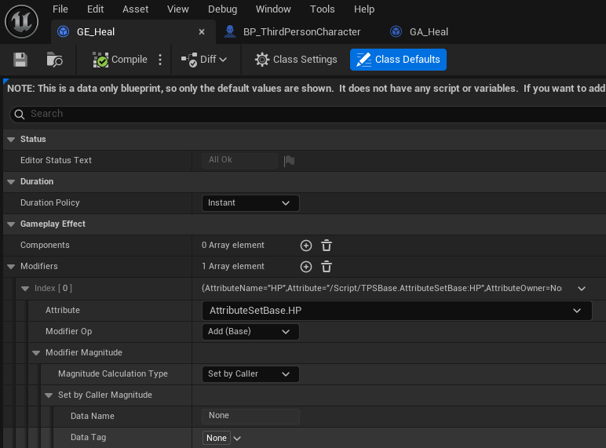

# GAS (Gameplay Ability System)

스킬, 스탯, 버프/디버프 등을 체계적이고 효율적으로 관리할 수 있도록 언리얼에서 제공하는 프레임워크

---

## 굵직한 개념 정리

### ASC (Ability Ssytem Component)

캐릭터에게 능력부여 및 실행 관리하는 컴포넌트


### AS (Attribute Set)

속성, 자원 세팅 및 적용은 여기서 한다


### GA (Gameplay Ability)

부여할 어빌리티 로직 클래스


### GE (Gameplay Effect)

버프 디버프 효과 정의
AS에 데이터 반영

---

## 사용법

---

### 1. 프로젝트 설정

#### 1-1. 빌드 추가
`.Builid.cs`  
```c++
using UnrealBuildTool;

public class TPSBase : ModuleRules
{
	public TPSBase(ReadOnlyTargetRules Target) : base(Target)
	{
		PCHUsage = PCHUsageMode.UseExplicitOrSharedPCHs;

		PublicDependencyModuleNames.AddRange(new string[] { "Core", "CoreUObject", "Engine", "InputCore", "EnhancedInput", 
		// 모듈 추가
		"GameplayAbilities", "GameplayTags", "GameplayTasks" });
	}
}
```

#### 1-2. 플러그인 추가
`.uproject`
```c++
  "Plugins": [
    {
      "Name": "GameplayAbilities",
      "Enabled": true
    }
  ]
```

자동으로 추가가 안될 때는 수동으로 입력 필요

### 2. ASC 생성
각 인스턴스는 해당 인스턴스의 어빌리티들을 관리하는 중앙관리 시스템이다.  
Ability를 부여/해제 할 수도 있고, 실행 여부 또한 이곳에서 관리된다.  
ASC 인스턴스 생성 필요 (보통 Character나 PlayerStat에 생성)  

#### 2-1. 인터페이스 상속
`TPSBaseCharacter.h`
```c++
#include "AbilitySystemInterface.h" // 라이브러리

class ATPSBaseCharacter : public ACharacter, public IAbilitySystemInterface
{
  ...
protected:
  // ASC 선언
  UPROPERTY(VisibleAnywhere, BlueprintReadOnly, Category="Abilities")
  class UAbilitySystemComponent* AbilitySystemComponent;
	
  // 오버라이드 
  virtual UAbilitySystemComponent* GetAbilitySystemComponent() const override;
}
```


#### 2-2. ASC 인스턴스 생성
`TPSBaseCharacter.cpp`
```c++
// 생성자
ATPSBaseCharacter::ATPSBaseCharacter()
{
  // 인스턴스 생성
  AbilitySystemComponent = CreateDefaultSubobject<UAbilitySystemComponent>(TEXT("AbilitySystemComponent"));
}

```

---

### 3. AS (AttributeSet) 생성
자원을 관리하는 시스템이다.

#### 3-1. AttributeSet 클래스 생성

`ASCharacterHealth`

#### 3-1-1. 속성 선언 및 추가
`ASCharacterHealth.h`
```c++
#include "AttributeSet.h"    // 라이브러리

// 매크로가 있으면 자동 함수 생성 (Accessor, Init, Getter, Setter)
#define ATTRIBUTE_ACCESSORS(ClassName, PropertyName) \
	GAMEPLAYATTRIBUTE_PROPERTY_GETTER(ClassName, PropertyName) \
	GAMEPLAYATTRIBUTE_VALUE_GETTER(PropertyName) \
	GAMEPLAYATTRIBUTE_VALUE_SETTER(PropertyName) \
	GAMEPLAYATTRIBUTE_VALUE_INITTER(PropertyName)

UCLASS()
class TPSBASE_API UAttributeSetBase : public UAttributeSet
{
	GENERATED_BODY()
public:
	UAttributeSetBase();
	
	// HP 속성 추가
	UPROPERTY(BlueprintReadOnly, Category="Attributes")
	FGameplayAttributeData HP;
	ATTRIBUTE_ACCESSORS(UAttributeSetBase, HP)
	
	// MaxHP 속성 추가
	UPROPERTY(BlueprintReadOnly, Category="Attributes")
	FGameplayAttributeData MaxHP;
	ATTRIBUTE_ACCESSORS(UAttributeSetBase, MaxHP)
	
};
```

#### 3-1-2. 초기값 입력
`AttributeSetBase.cpp`
```c++
#include "../public/AttributeSetBase.h"

// 생성자
UAttributeSetBase::UAttributeSetBase()
{
  // 초기화
  InitHP(50.f);
  InitMaxHP(100.f);
  InitMP(20.f);
  InitMaxMP(50.f);
}
```

PostGameplayEfectExecute 를 이용해서 속성 적용을 제한할 수 있다.
`AttributeSetBase.cpp`
```c++
void UAttributeSetBase::PostGameplayEffectExecute(const struct FGameplayEffectModCallbackData& Data)
{
  Super::PostGameplayEffectExecute(Data);
	
  // 이번에 변경된 요소 == HP
  if (Data.EvaluatedData.Attribute == GetHPAttribute())
  {
    // 0~MaxHP 사이로 적용
    SetHP(FMath::Clamp(GetHP(), 0.f, GetMaxHP()));
  }
  
  if (...) ...
}
```

#### 3-2. 인스턴스 생성

#### 3-2-1. 생성한 AttributeSet 선언

`TPSBaseCharacter.h`

```c++
#include "AttributeSetBase.h"

UCLASS(config=Game)
class ATPSBaseCharacter : public ACharacter, public IAbilitySystemInterface
{
  ...
    
protected:
  // AttributeSet 선언
  UPROPERTY()
	class UAttributeSetBase* AttributeSet;
}
```

#### 3-2-2. AttributeSet 인스턴스 생성

`TPSBaseCharacter.cpp`

```c++
#include "AttributeSetBase.h"

// 생성자
ATPSBaseCharacter::ATPSBaseCharacter()
{
  ...
  // AttributeSet 인스턴스 생성
  AttributeSet = CreateDefaultSubobject<UAttributeSetBase>(TEXT("AttributeSet"));
}
```

#### 3-2-3. AttributeSet 초기화

`TPSBaseCharacter.cpp`

```c++
void ATPSBaseCharacter::BeginPlay() // or Possess() 최초 1회 수행 위치
{
  // ASC 초기화
  if(AbilitySystemComponent) AbilitySystemComponent->InitAbilityActorInfo(this, this);
}
```

---

### 4. Ability 클래스 생성
실질적인 능력 로직을 구현을 하는 곳이다.

#### 4-1. HealAbility 클래스 생성

ASC를 갖고있는 인스턴스에서 UCLASS 형태로 전달하면 ASC가 새 인스턴스를 생성 관리하며 Activate 해준다.

`HealAbility.h`

```c++
#include "Abilities/GameplayAbility.h"  // 라이브러리

UCLASS()
class TPSBASE_API UHealAbility : public UGameplayAbility
{
  GENERATED_BODY()
public:
  UHealAbility();
  
protected:
  // 어빌리티 변수 선언
  UPROPERTY(EditDefaultsOnly, Category="Ability")
  float HealAmount = 30.f;
  
  
  protected:
  // ASC에서 어빌리티를 실행시키면 수행되는 곳
  // 오버라이드 필수다.
  virtual void ActivateAbility(const FGameplayAbilitySpecHandle Handle, const FGameplayAbilityActorInfo* ActorInfo, const FGameplayAbilityActivationInfo ActivationInfo, const FGameplayEventData* TriggerEventData) override;
	
};
```

`HealAbility.cpp`

```c++
#include "HealAbility.h"

UHealAbility::UHealAbility()
{
  // 정책은 어빌리티당 1개
    // InstancePerActor : 각 액터마다 1개의 인스턴스를 갖는다
    // InstancePerExcute : 실행마다 1개의 인스턴스를 갖는다
    // NonInstanced : 인스턴스 없이 CDO에서 관리된다.
  InstancingPolicy = EGameplayAbilityInstancingPolicy::InstancedPerActor;
}

void UHealAbility::ActivateAbility(const FGameplayAbilitySpecHandle Handle, const FGameplayAbilityActorInfo* ActorInfo,
	const FGameplayAbilityActivationInfo ActivationInfo, const FGameplayEventData* TriggerEventData)
{
  Super::ActivateAbility(Handle, ActorInfo, ActivationInfo, TriggerEventData);
  
  // Cost 사용 처리
  if (!CommitAbility(Handle, ActorInfo, ActivationInfo))
  {
    // Cost가 부족하면 End
    
    // 종료 시 항상 EndAbility가 있어야함
    // EndAbility가 없으면 해당 어빌리티가 실행중으로 판단됨
    EndAbility(Handle, ActorInfo, ActivationInfo, true, true);
    return;
  }
  
  UAbilitySystemComponent* ASC = ActorInfo->AbilitySystemComponent.Get();
  
  if (!ASC)
  {
    EndAbility(Handle, ActorInfo, ActivationInfo, true, true);
    return;
  }
  
  
  // -------------- 이부분은 보통 GE로 처리해야함 ------------------
  float HP = ASC->GetNumericAttribute(UAttributeSetBase::GetHPAttribute());
  float MaxHP = ASC->GetNumericAttribute(UAttributeSetBase::GetMaxHPAttribute());
  
  float NewHP = FMath::Clamp(HP + HealAmount, 0.f, MaxHP);
  
  // AS에 적용
  ASC->SetNumericAttributeBase(UAttributeSetBase::GetHPAttribute(), NewHP);
  // ------------------------------------------------------------
  
  EndAbility(Handle, ActorInfo, ActivationInfo, true, true);
	
}
```

#### 4-2. 캐릭터에게 HealAbility 정보 넘기기

`TPSBaseCharacter.h`
```c++
class ATPSBaseCharacter : public ACharacter, public IAbilitySystemInterface
{
  ...
  
protected:
  // HealAbility 클래스 받아오기
  UPROPERTY(EditDefaultsOnly)
  TSubclassOf<UGameplayAbility> HealAbilityClass;
  
}
```


#### 4-3. BP 로 클래스 적용

`BP_TPSBaseCharacter` 의 `HealAbilityClass`에 `BP_HealAbility` 적용


```c++
  // cpp는 StaticClass로 적용
  TSubclassOf<UGameplayAbility> HealAbilityClass = UHealAbility::StaticClass();
```

### 5. GE (GameplayEffect) 추가
GA에선 판단을 한다면, GE에선 실제 데이터에 적용을 해준다.  
블루프린트로 주로 관리된다.  

#### 5-1. GE BP 생성
Blueprint Class - GameplayEffect 상속


#### 5-2. GE 속성 설정

Magnitude는 HealAmount 값을 넘겨받을 예정



#### 5-3. GA 헤더에 GE 변수 추가

GameAbility에서 바로 HP를 적용하던걸, GameplayEffect로 변경할 것이다.

HealEffect 선언

`HealAbility.h`

```c++
#include "GameplayEffect.h"

class TPSBASE_API UHealAbility : public UGameplayAbility
{
  ...
  
protected:
  UPROPERTY(EditDefaultsOnly, Category = "GAS")
  TSubclassOf<UGameplayEffect> HealEffectClass;
}
```

#### 5-4. 어빌리티 cpp에 GE 적용

`HealAbility.cpp`

```c++
#include "HealAbility.h"

void UHealAbility::ActivateAbility(const FGameplayAbilitySpecHandle Handle, const FGameplayAbilityActorInfo* ActorInfo,
	const FGameplayAbilityActivationInfo ActivationInfo, const FGameplayEventData* TriggerEventData)
{
  Super::ActivateAbility(Handle, ActorInfo, ActivationInfo, TriggerEventData);
  
  ...
  
  /* 게임플레이 이펙트로 변경
  float HP = ASC->GetNumericAttribute(UAttributeSetBase::GetHPAttribute());
  float MaxHP = ASC->GetNumericAttribute(UAttributeSetBase::GetMaxHPAttribute());
  
  float NewHP = FMath::Clamp(HP + HealAmount, 0.f, MaxHP);
  
  // AS에 적용
  ASC->SetNumericAttributeBase(UAttributeSetBase::GetHPAttribute(), NewHP);
  */
  
  if (HealEffectClass)
  {
    // 이펙트 부가정보 
    FGameplayEffectContextHandle EffectContext = ASC->MakeEffectContext();
    // 해당 이펙트 owner 전달
    EffectContext.AddSourceObject(this);
    
    // ASC가 HealEffectClass로 인스턴스 생성하겠다.
    FGameplayEffectSpecHandle SpecHandle = ASC->MakeOutgoingSpec(HealEffectClass, 1.f, EffectContext);
    
    if (SpecHandle.IsValid())
    {
      // SetByCaller : GE 내부에 변수 집어넣는 기능
      // "Data.HealAmount" 태그에 {HealAmount} 값이 저장
      SpecHandle.Data->SetSetByCallerMagnitude(FGameplayTag::RequestGameplayTag( FName("Data.HealAmount")), HealAmount);
      
      // Tag = "Data.HealAmount"
      // Value = 30.f
      ASC->ApplyGameplayEffectSpecToSelf(*SpecHandle.Data.Get());
    }
  }
  
  EndAbility(Handle, ActorInfo, ActivationInfo, true, true);
	
}
```

### 6. ASC에 Ability 부여 / 해제

어빌리티를 부여받으면 사용할 수 있는 환경이 된 것

부여 / 해제 방법

```c++
void ATPSBaseCharacter::GiveStartupAbilities()
{
  // if (!HasAuthority()) return;       // 서버용
  
  // 전체 어빌리티 삭제
  ASC->ClearAllAbilities();             // 전체 해제
  // ASC->ClearAbility(AbilityHandle);  // 개별 해제
  
  for (const auto& AbilityClass : StartupAbilities)
  {
    if (!AbilityClass) continue;
    // 어빌리티 부여
    AbilitySystemComponent->GiveAbility(FGameplayAbilitySpec(AbilityClass, 1));
  }
}
```

#### 6-1. Ability 구현 위치

Case 1
> PlayerState : ASC  
> Character : Avater  
> -> PossessedBy() 에서 제공

Case 2
> Character : ASC, Avater  
> -> BeginPlay() 에서 제공


Case 3
> 게임 도중에 스킬/아이템 언락  
> -> 이벤트 시점에 ASC->GiveAbility(SkillAbility);

### 7. 어빌리티 사용

```c++
void ATPSBaseCharacter::UseHealAbility()
{
  AbilitySystemComponent->CanActivateAbility(HealAbilityClass);         // 사용 가능한지 체크
  AbilitySystemComponent->CallActivateAbility(HealAbilityClass);        // 체크 없이 바로 호출
  AbilitySystemComponent->TryActivateAbilityByClass(HealAbilityClass);  // 체크 후 사용 가능하면 호출 
}
```
