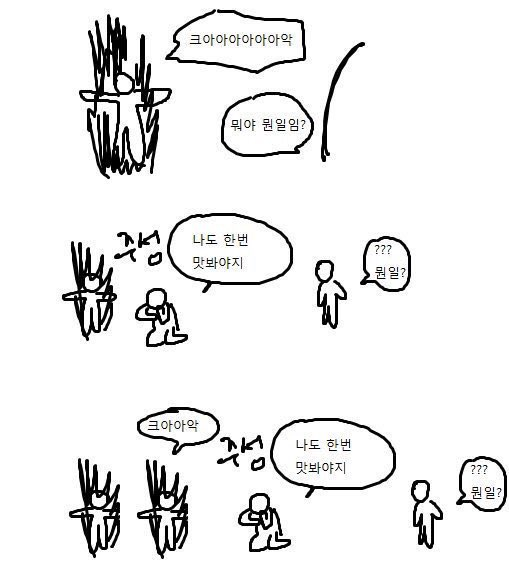

# TIL - GAS 총기 히트 판정 디테일

---

## 1. 관통 처리 하고싶다..!

### 증상
탄 하나에 여러명 죽는 판정을 하고싶은 증상이 발현되어버렸다.

### 해결
일단 관통을 할 대상은 모든 콜리전에 Overlap으로 세팅하고,  
관통 못할 대상에게는 콜리전에 Block으로 세팅해야함.

그리고 총알 콜리전에서 반환된 HitResult을 모두 처리하면 관통 처리 완성!!  
관통 제한도 두면 N명 까지 관통 가능하게 설정 가능하다.  

## 2. 맞은 애가 또 맞는 이슈 발생;;

---

### 증상
한 놈이 여러번 맞으면서 Monster1의 Bone1, Bone2, Bone3 을 맞추면서 전부 관통이 되어버린다.  
스나이퍼 엘리트같은 게임처럼 한 액터에 여러 본을 맞춰야한다면 필요하겠지만, 우린 아니다. 

### 해결
TSet<AActor> 로 피격당한 액터 수집  

히트 판정된 Actor가 Set 리스트에 없으면 히트 판정, 없으면 Continue로 다음 HitResult 처리

---

## 3. 관통하려면 채널 설정 필수
Collision Visibility 채널값을 Block으로하면 Sweep이 거기서 멈춘다. 꼭 Overlap으로 하여 관통처리를 해야한다.

---

## 정리

- Multi 채널로 여러 HitResult 받아오기
- Set 으로 한 번 처리한 액터는 중복처리 하지 않도록 설정
- Collision 설정은 Overlap으로 해야 관통됨. Block이면 막힘.
